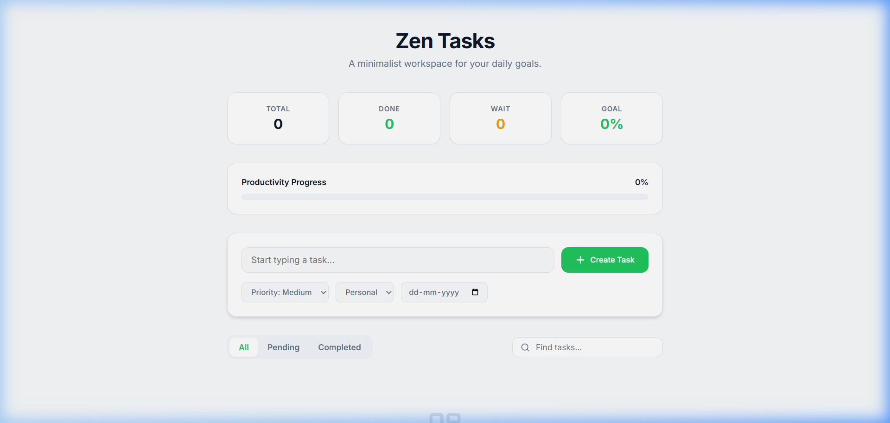

# 🌿 Zen Tasks | Minimalist Productivity Dashboard

Zen Tasks is a premium, full-featured Todo List application designed with a sleek SaaS aesthetic. It focuses on effortless productivity through a minimalist interface, smooth animations, and powerful organization features.



## 🚀 Live Demo
Experience the live application here: **[Zen Tasks Live](https://himanshushekharon.github.io/TodoList/)**

---

## ✨ Key Features

### 💎 Premium Design System
- **SaaS Aesthetic**: Clean light theme with an Emerald Green primary accent.
- **Card-Based UI**: Organized dashboard with subtle shadows and rounded corners.
- **Modern Typography**: Uses the professional **Inter** font family for high readability.
- **Responsive Layout**: Optimized for desktop, tablet, and mobile devices.

### 📊 Real-Time Analytics
- **Live Stats**: Instant tracking of Total, Done, and Pending tasks.
- **Productivity Progress**: Visual progress bar showing your completion percentage at a glance.

### 🛠️ Advanced Task Management
- **Task Metadata**: Set Priority levels (Low, Medium, High) and Categories.
- **Due Dates**: Integrated date tracking for better planning.
- **Dynamic Search**: Find tasks instantly with real-time text matching.
- **Smooth Animations**: Powered by Framer Motion for a fluid user experience.

### 💾 Local Persistence
- **Auto-Save**: All tasks are automatically saved to your browser's **LocalStorage**.
- **No Backend Needed**: Fully functional offline/frontend-only architectural design.

---

## 🛠️ Technology Stack
- **Frontend**: [React 19](https://reactjs.org/)
- **Build Tool**: [Vite 7](https://vitejs.dev/)
- **Animations**: [Framer Motion](https://www.framer.com/motion/)
- **Icons**: [Lucide React](https://lucide.dev/)
- **Styling**: Vanilla CSS (Modern CSS Variables)
- **Deployment**: GitHub Pages

---

## 🏗️ Installation & Setup

1. **Clone the repository**:
   ```bash
   git clone https://github.com/himanshushekharon/TodoList.git
   ```

2. **Install dependencies**:
   ```bash
   npm install
   ```

3. **Run development server**:
   ```bash
   npm run dev
   ```

4. **Build for production**:
   ```bash
   npm run build
   ```

## 📜 License
This project is open-source and available under the MIT License.

---
Built with passion for productivity. © 2026 Zen Tasks.
